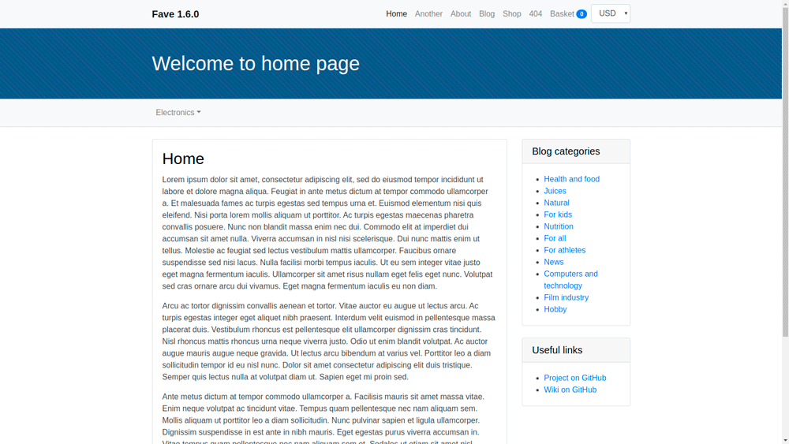

[](https://dashboard.cypress.io/#/projects/hv532c/runs)
# golang-fave
CMS written on Go with MySQL as database. Dynamical, splitted by modules, user friendly and thanks bootstrap is fully adaptive for mobile devices and tablets. All in one binary file, no need to install additional web servers. Go native templates with vars allow to do almost all what are need.

## Screenshots


## Usage
```
Usage of ./fave:
  -debug
    debug mode with ignoring log files
  -dir string
    virtual hosts directory
  -host string
    server host (default "0.0.0.0")
  -keepalive
    enable/disable server keep alive
  -port int
    server port (default 8080)
```

## Hosts structure
```
hosts
├── localhost                      # Main host directory
├──── config                       # Config directory
├────── .domains                   # Attached domains
├────── config.json                # CMS config file
├────── mysql.json                 # MySQL config file
├──── htdocs                       # Public http files
├──── logs                         # Logs dir
├────── access.log                 # Access log file
├────── error.log                  # Error log file
├──── template                     # Engine templates
├────── 404.html                   # Template for 404 page
├────── blog-category.html         # Template for blog category
├────── blog-post.html             # Template for blog post
├────── blog.html                  # Template for blog home page
├────── cached-block-1.html        # Cached block 1
├────── cached-block-2.html        # Cached block 2
├────── cached-block-3.html        # Cached block 3
├────── cached-block-4.html        # Cached block 4
├────── cached-block-5.html        # Cached block 5
├────── email-new-order-admin.html # New order email template
├────── email-new-order-user.html  # New order email template
├────── footer.html                # Footer
├────── header.html                # Header
├────── index.html                 # Template for home page
├────── maintenance.html           # Template for maintenance page
├────── page.html                  # Template for any other pages
├────── robots.txt                 # Host robots.txt file
├────── scripts.js                 # Theme scripts file
├────── shop-category.html         # Template for shop category
├────── shop-product.html          # Template for shop product
├────── shop.html                  # Template for shop home page
├────── sidebar-left.html          # Can be included in templates
├────── sidebar-right.html         # Can be included in templates
├────── styles.css                 # Theme styles file
└──── tmp                          # Temporary dir for session files
```
Unlimited hosts count. Template variables in [Wiki](https://github.com/vladimirok5959/golang-fave/wiki) or [here](https://github.com/vladimirok5959/golang-fave/wiki/Variables-for-template-($.Data)) and [here](https://github.com/vladimirok5959/golang-fave/wiki/Variables-for-template-($.System)).<br>
Docker image: [https://hub.docker.com/r/vladimirok5959/fave](https://hub.docker.com/r/vladimirok5959/fave)

## Development
**In root dir**
* **make** - vet, test, build and run in debug mode locally
* **make build** - build release for Linux, Mac OS X and Windows
* **make format** - format all code by gofmt utility
* **make update** - get all dependencies and put to vendor folder
* **make docker-test** - build image and start on port 8080
* **make docker-img** - build docker image only
* **make docker-push** - build and push image to docker hub
* **make migrate** - create new empty migration file

**In support dir**
* **make cy-dev** - cypress tests in browser
* **make cy** - cypress tests in console
* **make ab** - http stress test

## Roadmap
| Task                      | Status        | Done |
| :---                      | :---          | :--- |
| Module Pages              | ready for use | 100% |
| Module Blog               | ready for use | 100% |
| Module Shop               | ready for use | 100% |
| Files manager             | in progress   | 0%   |
| Shop products filters     | in progress   | 0%   |
| Shop payments integration | in progress   | 0%   |

## Used resources
* [jQuery](https://github.com/jquery/jquery) (MIT License)
* [Autosize](https://github.com/jackmoore/autosize) (MIT License)
* [Sortable](https://github.com/SortableJS/Sortable) (MIT License)
* [Bootstrap](https://github.com/twbs/bootstrap) (MIT License)
* [CodeMirror](https://github.com/codemirror/codemirror) (MIT License)
* [Pell WYSIWYG](https://github.com/jaredreich/pell) (MIT License)
* [Bootstrap select](https://github.com/snapappointments/bootstrap-select/) (MIT License)
