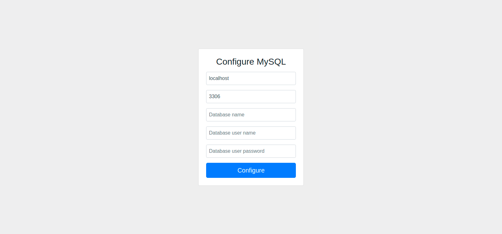

# golang-fave
CMS written on Go with MySQL as database. Dynamical, splitted by modules, user friendly and thanks bootstrap is fully adaptive for mobile devices and tablets. Thanks Go language it's fastern, all in one binary file, no need to install additional web servers. Go native template with vars allow to do almost all what are need.



## Usage
```
Usage of ./fave:
  -debug
    debug mode with ignoring log files
  -dir string
    virtual hosts directory
  -host string
    server host (default "0.0.0.0")
  -port int
    server port (default 8080)
```

## Hosts structure
```
hosts
├── localhost        # Main host directory
├──── config         # Config directory
├────── mysql.json   # MySQL config file
├──── htdocs         # Public http files
├──── logs           # Logs dir
├────── access.log   # Access log file
├────── error.log    # Error log file
├──── template       # Engine templates
├────── 404.html     # Template for 404 page
├────── footer.html  # Footer
├────── header.html  # Header
├────── index.html   # Template for index page
├────── page.html    # Template for any other pages
├────── sidebar.html # Can be included in templates
└──── tmp            # Temporary dir for session files
```
Unlimited hosts count. Template variables in [Wiki](https://github.com/vladimirok5959/golang-fave/wiki) or [here](https://github.com/vladimirok5959/golang-fave/wiki/Variables-for-template-($.Data)) and [here](https://github.com/vladimirok5959/golang-fave/wiki/Variables-for-template-($.System)).

## Development
* **make** - vet, test, build and run in debug mode locally
* **make build** - build release for Linux, Mac OS X and Windows
* **make format** - format all code by gofmt utility
* **make update** - get all dependencies and put to vendor folder
* **make docker-test** - build image and start on port 8080
* **make docker-img** - build docker image only
